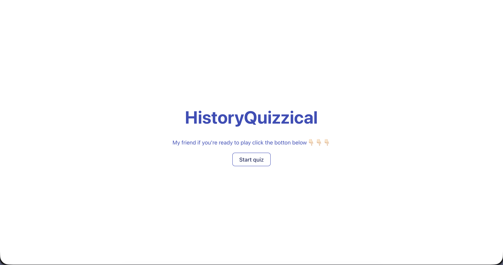
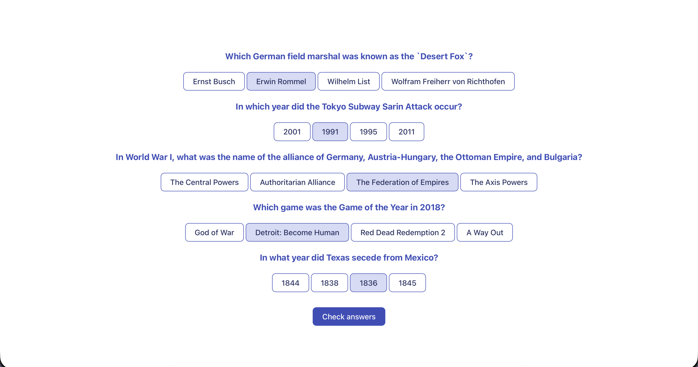
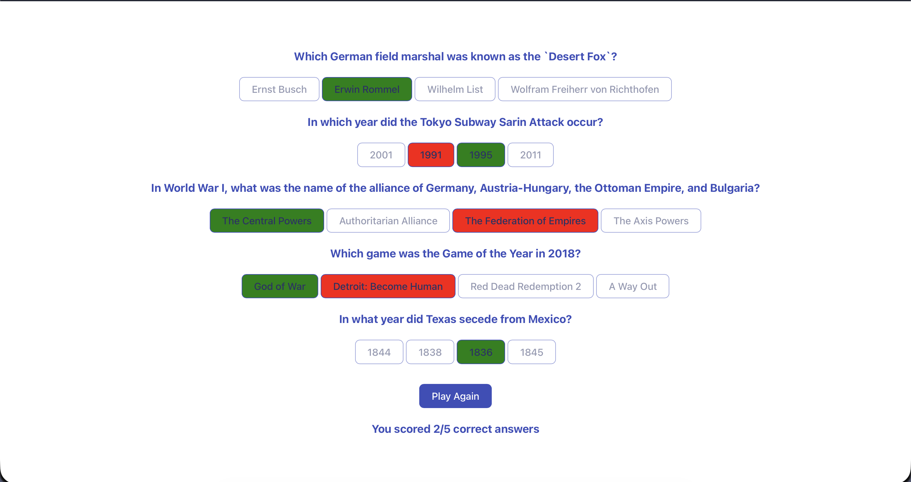

HistoryQuizzical 🏛️
HistoryQuizzical is a dynamic web application built with React and Vite that tests your knowledge of history. It fetches real-time trivia questions from the Open Trivia Database API and provides an interactive quiz experience.

✨ Features
Dynamic Question Fetching: Retrieves 5 history-themed questions per round from the OpenDB API.
Randomized Answers: Automatically shuffles correct and incorrect answers for a unique experience every time.

Instant Feedback: After completing the quiz, the app highlights:
✅ Green: Correct answers.
❌ Red: Incorrect selections.
🔘 Dimmed: Unselected options.

HTML Entity Decoding: Uses the he library to ensure special characters (like quotes and accents) are rendered correctly.
Score Tracking: Shows your final score at the end of each round.
Play Again: Seamlessly restart the quiz with a fresh set of questions without refreshing the page.

🛠️ Technologies Used
React (Hooks: useState, useEffect)
Vite (Build tool)
CSS3 (Custom styling)
Open Trivia DB API (Data source)
he (Library for HTML entity decoding)

🚀 Getting Started
To get a local copy up and running, follow these steps:
Clone the repository:
bash
git clone github.com

Install dependencies:
bash
npm install

Install the 'he' library (if not already present):
bash
npm install he

Run the development server:
bash
npm run dev

Open the app: Navigate to http://localhost:5173 in your browser.

Start Screen

Quizz Screen

Check answer

